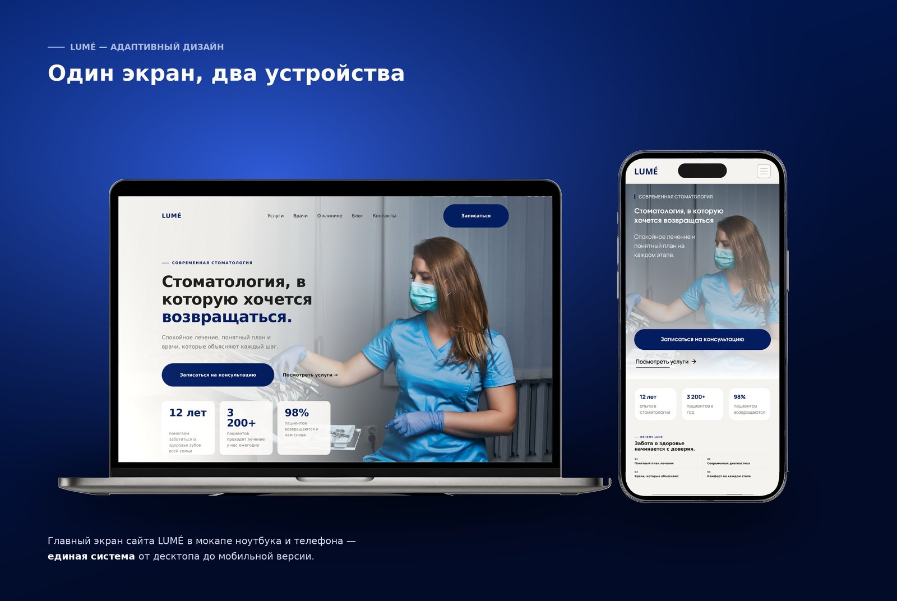
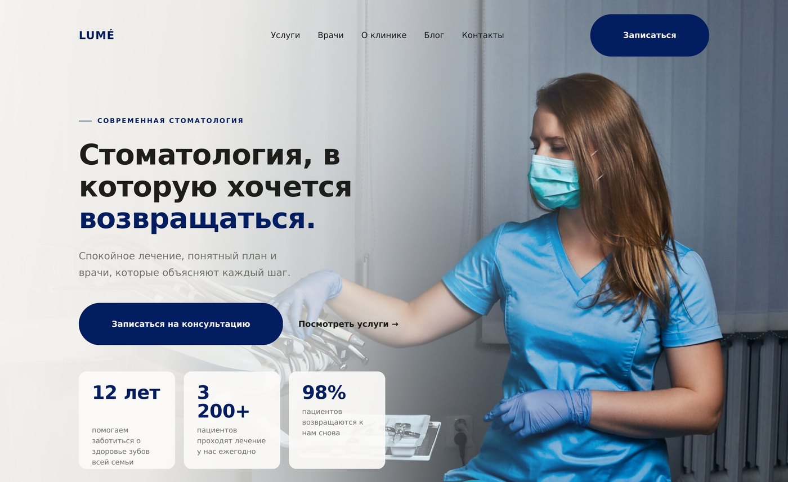
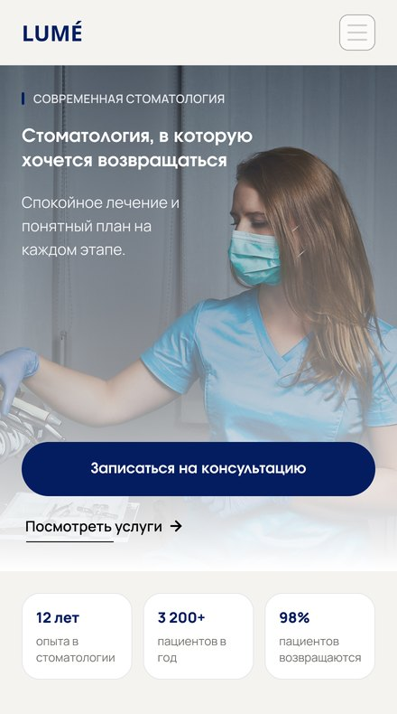
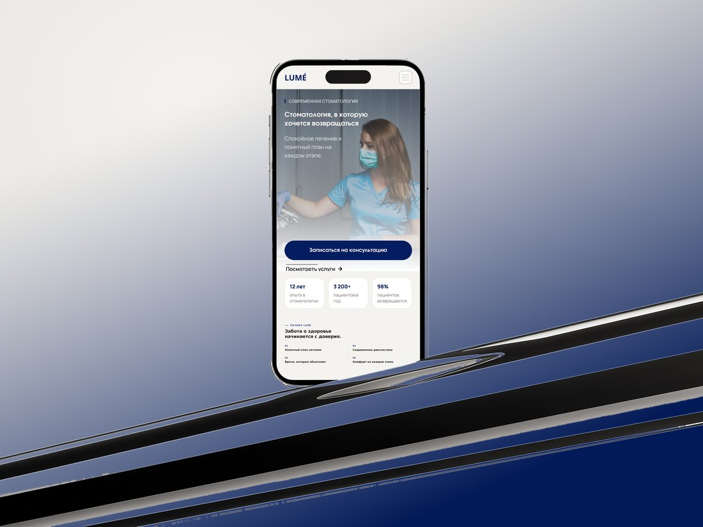

# LUMÉ — сайт стоматологической клиники

Лендинг вымышленной стоматологии LUMÉ: концепция, дизайн и фронтенд.
Учебный кейс — задача была не «сделать ещё один медицинский сайт», а снять тревогу,
с которой человек открывает страницу стоматологии.

**[→ Смотреть демо](https://zizi055.github.io/lume/)**



---

## О проекте

Типовой сайт стоматологии продаёт «скидку 30% на имплант» и показывает крупные планы
инструментов. Человек, который и так боится, закрывает вкладку.

Поэтому здесь другая логика первого экрана и всей страницы:

- **Спокойная палитра и воздух.** Тёплый бежевый фон, глубокий синий акцент, много пустого места.
- **Порядок блоков = путь пациента.** Первое впечатление → доверие → услуги → врачи → истории → запись.
- **Люди вместо оборудования.** На фотографиях врачи и пациенты, а не бормашины.
- **Прозрачность вместо давления.** Никаких таймеров и «осталось 2 места» — понятный план и цифры.

---

## Стек

| Технология | Зачем |
| --- | --- |
| **React 18** | Компонентная структура: девять секций собираются из независимых блоков |
| **TypeScript** | Строгий режим, контент типизирован — опечатка в данных ловится на сборке |
| **SCSS + CSS Modules** | Стили рядом с компонентом, классы не конфликтуют |
| **Vite** | Быстрый дев-сервер и сборка |
| **ESLint + Prettier** | Единый стиль кода, проверка на CI |
| **GitHub Actions** | Автодеплой на GitHub Pages при пуше в `main` |

Библиотек UI и анимаций нет намеренно: вся вёрстка, сетки и движение написаны руками.

---

## Скриншоты

**Десктоп — первый экран**



**Мобильная версия**





---

## Дизайн-система

Токены живут в одном месте — `src/styles/global.scss`, блок `:root`.
Смена акцентного цвета или радиусов — это правка нескольких строк, а не поиск по проекту.

| Токен | Значение | Роль |
| --- | --- | --- |
| `--bg` | `#F5F3EF` | Фон страницы |
| `--surface` | `#FCFBF9` | Карточки и светлые секции |
| `--ink` | `#1D1D1B` | Основной текст |
| `--muted` | `#6F706C` | Второстепенный текст |
| `--line` | `#E5E1DA` | Границы и разделители |
| `--accent` | `#031D61` | Акцент: кнопки, ссылки, цифры |
| `--accent-soft` | `#D6DCEF` | Подложки и бейджи |
| `--deep` | `#041233` | Тёмные блоки: запись, подвал |
| `--radius` / `--radius-lg` | `14px` / `22px` | Скругления |
| `--ease` | `cubic-bezier(.22, 1, .36, 1)` | Единая кривая для всех переходов |

Шрифт — **Manrope** (400–800). Заголовки набраны `clamp()`, поэтому размер тянется
за шириной экрана без промежуточных медиа-запросов.

Сетка у каждой секции своя (от `repeat(4, 1fr)` до `1.3fr .8fr`) — общей 12-колоночной
сетки нет: блоки разной природы, и подгонка под универсальную сетку сделала бы ритм монотонным.

---

## Структура

```
src/
├── assets/images/        Фотографии, попадающие в бандл
├── components/
│   ├── layout/           Шапка, подвал, мобильная кнопка записи
│   ├── sections/         Девять секций страницы, у каждой свой SCSS-модуль
│   └── ui/               Button, Container, Icon, SectionHead
├── data/                 Контент: услуги, врачи, отзывы, статьи
├── hooks/                useReveal, useParallax, useScrolled и другие
├── styles/               Токены, миксины, ресет, глобальные стили
└── types/                Общие интерфейсы
```

Контент вынесен из разметки в `src/data`: чтобы поправить текст услуги,
не нужно открывать компонент.

---

## Что интересного внутри

**Появление блоков при скролле** (`useReveal`) — один `IntersectionObserver` на элемент,
после срабатывания наблюдение снимается. Если API недоступен, контент показывается сразу:
лучше без анимации, чем пустая страница.

**Параллакс** (`useParallax`) — чтение геометрии и запись `transform` внутри
`requestAnimationFrame`, не чаще одного раза за кадр. При системной настройке
«уменьшить движение» эффект не включается вовсе.

**Превью услуг** — активная строка хранится в состоянии, а не в CSS `:has()`,
поэтому превью реагирует и на фокус с клавиатуры, а не только на мышь.

**Доступность** — семантические теги, `aria-expanded` и `aria-controls` у бургера,
видимый фокус, альтернативные тексты, контраст текста от 4.5:1.

---

## Запуск

Нужен Node.js 20+.

```bash
git clone https://github.com/Zizi055/lume.git
cd lume
npm install
npm run dev
```

| Команда | Что делает |
| --- | --- |
| `npm run dev` | Дев-сервер с горячей перезагрузкой |
| `npm run build` | Проверка типов и продакшн-сборка в `dist/` |
| `npm run preview` | Локальный просмотр собранной версии |
| `npm run lint` | ESLint |
| `npm run typecheck` | Проверка типов без сборки |
| `npm run format` | Prettier |

---

## Деплой

Пуш в `main` запускает workflow `.github/workflows/deploy.yml`: линт → проверка типов →
сборка → публикация на GitHub Pages.

Проект отдаётся из подпапки, поэтому базовый путь передаётся в сборку переменной `VITE_BASE`.
Локально она не нужна.

Чтобы демо заработало: **Settings → Pages → Source → GitHub Actions**.

---

## Оговорки

Это демонстрационный проект. Клиника, врачи, отзывы и контакты вымышленные.
Форма записи не отправляет данные на сервер — валидация и экран подтверждения работают
на клиенте, точка для интеграции с API отмечена в `Booking.tsx`.

Фотографии — [Unsplash](https://unsplash.com/license) (свободная лицензия).

---

## English

Landing page for a fictional dental clinic — a portfolio case study on reducing
patient anxiety through visual design.

Built with **React 18 + TypeScript + SCSS Modules + Vite**, no UI or animation libraries:
layout, grids and motion are hand-written. Design tokens live in a single `:root` block,
content is separated from markup, and scroll animations respect `prefers-reduced-motion`.

**[Live demo](https://zizi055.github.io/lume/)** · [MIT License](LICENSE)

---

© 2026 · MIT
